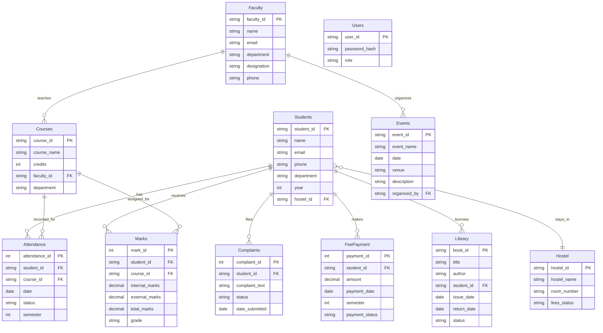

# Entity-Relationship (ER) Diagram & Relational Model

## ER Diagram Entities & Attributes
1. **Students**: student_id (PK), name, email, phone, department, year, hostel_id (FK)
2. **Faculty**: faculty_id (PK), name, email, department, designation, phone
3. **Courses**: course_id (PK), course_name, credits, faculty_id (FK), department
4. **Attendance**: attendance_id (PK), student_id (FK), course_id (FK), date, status, semester
5. **Marks/Grades**: mark_id (PK), student_id (FK), course_id (FK), internal_marks, external_marks, total_marks, grade
6. **Library**: book_id (PK), title, author, student_id (FK), issue_date, return_date, status
7. **Hostel**: hostel_id (PK), hostel_name, room_number, fees_status
8. **Events**: event_id (PK), event_name, date, venue, description, organized_by (FK)
9. **Complaints**: complaint_id (PK), student_id (FK), complaint_text, status, date_submitted
10. **FeePayment**: payment_id (PK), student_id (FK), amount, payment_date, semester, payment_status
11. **Users**: user_id (PK), password_hash, role (ENUM: Student, Faculty, Admin, HOD, Dean, Director, Librarian)

## Relationships
- **Student-Hostel** (Many-to-One): Many students can stay in one hostel. 
- **Faculty-Course** (One-to-Many): One faculty member can teach multiple courses.
- **Student-Course** (Many-to-Many): Implemented through bridging tables `Attendance` and `Marks`.
- **Student-Library** (One-to-Many): One student can borrow multiple books.
- **Faculty-Event** (One-to-Many): One faculty organizes many events.
- **Student-Complaint** (One-to-Many): One student can file multiple complaints.
- **Student-FeePayment** (One-to-Many): One student can make multiple fee payments.

## Mermaid ER Diagram Representation

## Relational Model Schema

- **Hostel** (hostel_id, hostel_name, room_number, fees_status)
- **Students** (student_id, name, email, phone, department, year, hostel_id)
- **Faculty** (faculty_id, name, email, department, designation, phone)
- **Courses** (course_id, course_name, credits, faculty_id, department)
- **Attendance** (attendance_id, student_id, course_id, date, status, semester)
- **Marks** (mark_id, student_id, course_id, internal_marks, external_marks, total_marks, grade)
- **Library** (book_id, title, author, student_id, issue_date, return_date, status)
- **Events** (event_id, event_name, date, venue, description, organized_by)
- **Complaints** (complaint_id, student_id, complaint_text, status, date_submitted)
- **FeePayment** (payment_id, student_id, amount, payment_date, semester, payment_status)
- **Users** (user_id, password_hash, role)
